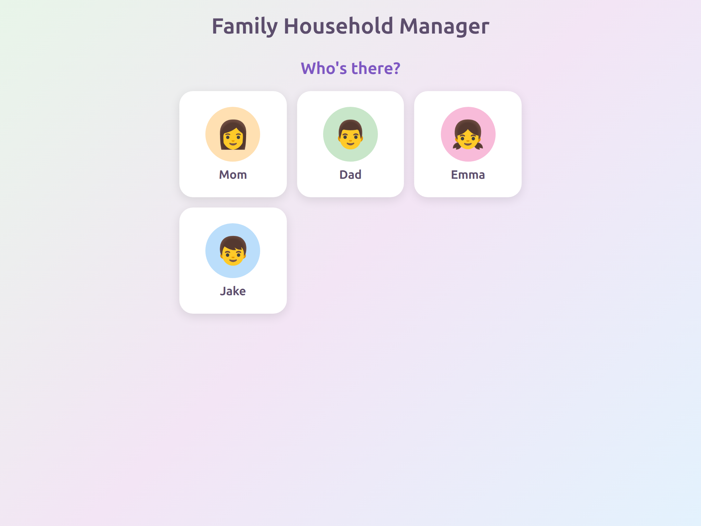
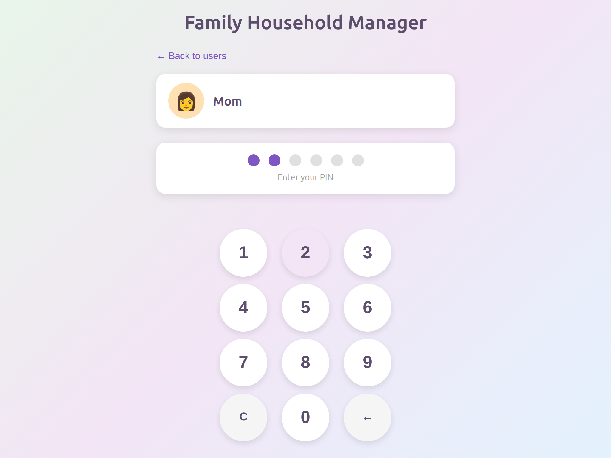

# Family Household Manager

A self-hosted household management system for families, designed to run as a Home Assistant add-on. Track chores, routines, earnings, and streaks for family members with a simple, kid-friendly interface.

## Features

- **PIN-Based Authentication** - Simple 4-6 digit PIN login for each family member, no passwords to remember
- **Routine Management** - Create daily routines with ordered tasks for each child
- **Streak Tracking** - Build and maintain streaks for completing daily routines
- **Earnings & Balance** - Assign dollar values to tasks and track earnings over time
- **Family Dashboard** - Parent overview showing all family members' progress at a glance
- **Notifications** - Stay informed about task completions and milestones
- **Vacation Mode** - Pause routines when the family is away
- **Sick Day Support** - Mark tasks complete when a child is sick without affecting their streak

## Screenshots

### Login Screen
Select your avatar and enter your PIN to log in.





## Installation

### Prerequisites

- Home Assistant with Supervisor installed (Home Assistant OS or Supervised)

### Adding the Repository

1. Navigate to **Settings > Add-ons > Add-on Store**
2. Click the three-dot menu in the top right corner
3. Select **Repositories**
4. Add this repository URL
5. Click **Add**

### Installing the Add-on

1. Find "Family Household Manager" in the add-on store
2. Click **Install**
3. Wait for the installation to complete

### Configuration

No configuration required! The add-on is self-contained with an embedded SQLite database. Just install and start.

The database is automatically created at `/data/family-chores.db` inside the add-on container, which persists across restarts and updates.

## Usage

### Quick Start

1. **Start the add-on** and open the web UI
2. **Complete onboarding** - Create your household and add the first parent account
3. **Add family members** - Add children with their names, avatars, and optional PINs
4. **Create tasks** - Define tasks with names, descriptions, icons, and dollar values
5. **Build routines** - Assign tasks to routines and assign routines to children
6. **Track progress** - Monitor completion, streaks, and earnings from the family dashboard

### User Roles

- **Parent (Admin)**: Can manage tasks, routines, users, and view all family members' progress
- **Child**: Can view and complete their assigned tasks, see their own streaks and balance

## API Documentation

The Family Household Manager provides a RESTful API for all operations. See the [API Documentation](docs/API.md) for complete endpoint reference.

### Key Endpoints

| Resource | Endpoints |
|----------|-----------|
| Authentication | `/api/auth/login`, `/api/users`, `/api/avatars` |
| Tasks | `/api/tasks` (CRUD) |
| Routines | `/api/routines` (CRUD) |
| Dashboard | `/api/dashboard` |
| Family | `/api/family/dashboard`, `/api/family/vacation-mode`, `/api/family/sick-day/:userId` |
| Balance | `/api/balance`, `/api/balance/transactions`, `/api/balance/redeem` |
| Notifications | `/api/notifications` |
| Admin | `/api/admin/*` |

## Tech Stack

- **Backend**: Node.js 20+ with Express.js
- **Database**: SQLite (embedded, self-contained)
- **Authentication**: JWT tokens with PIN-based login
- **Frontend**: Vanilla JavaScript with HTML/CSS
- **Container**: Alpine Linux-based Docker image
- **Testing**: Playwright for end-to-end tests

## Project Structure

```
family-chores/
├── src/
│   ├── server.js          # Express application entry point
│   ├── auth/              # JWT authentication
│   ├── db/                # Database connection and initialization
│   ├── jobs/              # Scheduled jobs (streak calculator)
│   ├── middleware/        # Auth, caching, rate limiting, error handling
│   ├── models/            # Data models
│   ├── routes/            # API route handlers
│   ├── utils/             # Utility functions
│   ├── validators/        # Request validation
│   ├── config/            # Configuration (milestones, etc.)
│   ├── data/              # Static data (avatars)
│   └── public/            # Frontend HTML/CSS/JS
├── config.yaml            # Home Assistant add-on configuration
├── Dockerfile             # Container build configuration
├── run.sh                 # Container entry point
└── package.json           # Node.js dependencies
```

## Contributing

We welcome contributions! Please see [CONTRIBUTING.md](CONTRIBUTING.md) for guidelines on:

- Setting up your development environment
- Code style and conventions
- Submitting issues and pull requests
- Testing requirements

## License

This project is licensed under the MIT License - see the [LICENSE](LICENSE) file for details.

## Support

- **Issues**: Report bugs or request features via GitHub Issues
- **Documentation**: Check the [docs/](docs/) folder for detailed guides

---

Made with care for families everywhere.
